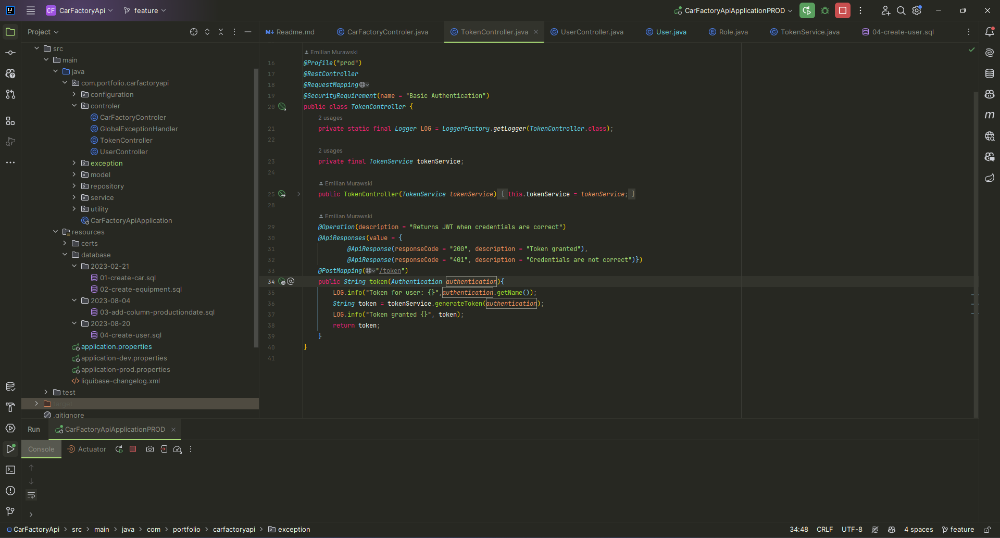
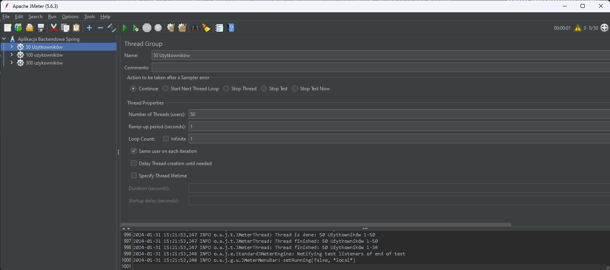
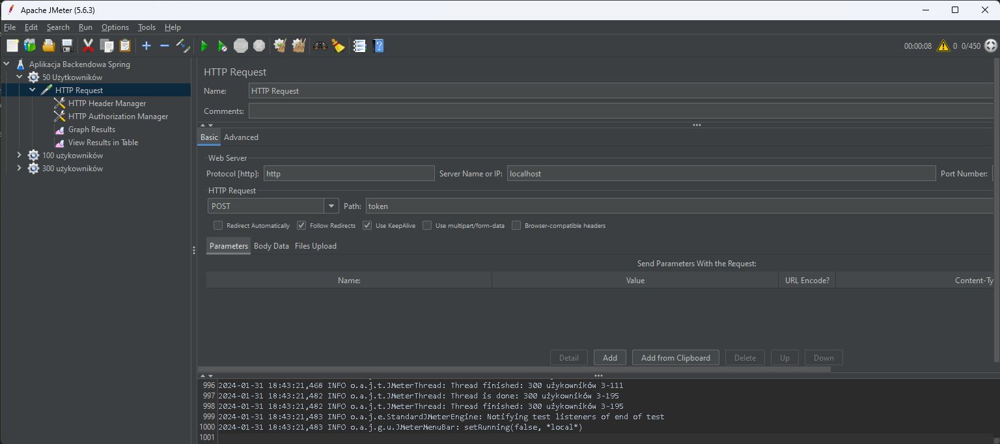
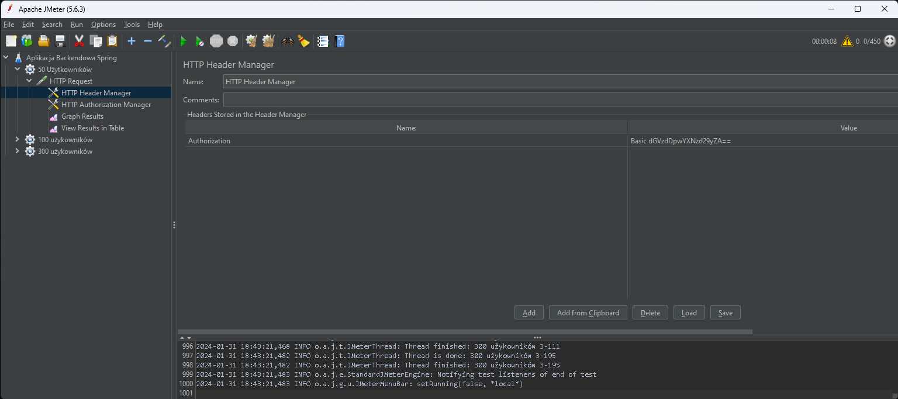
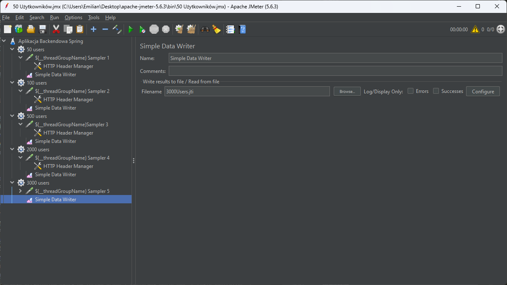
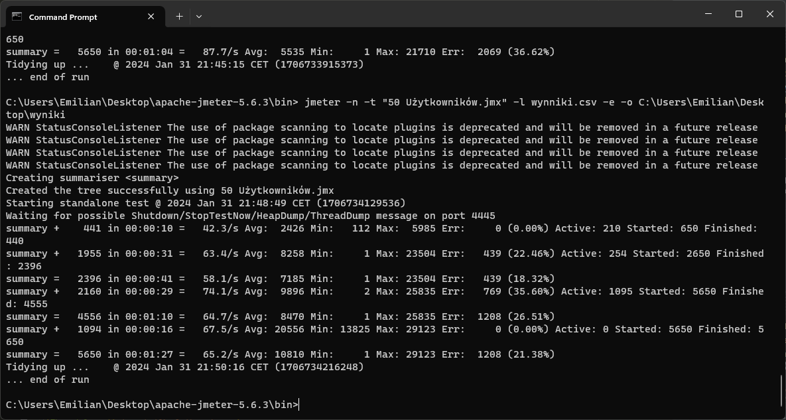
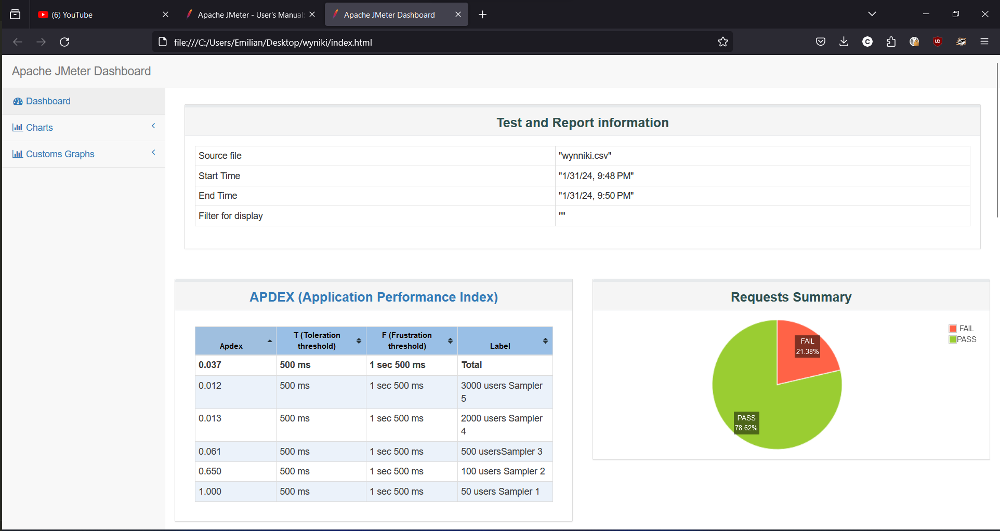
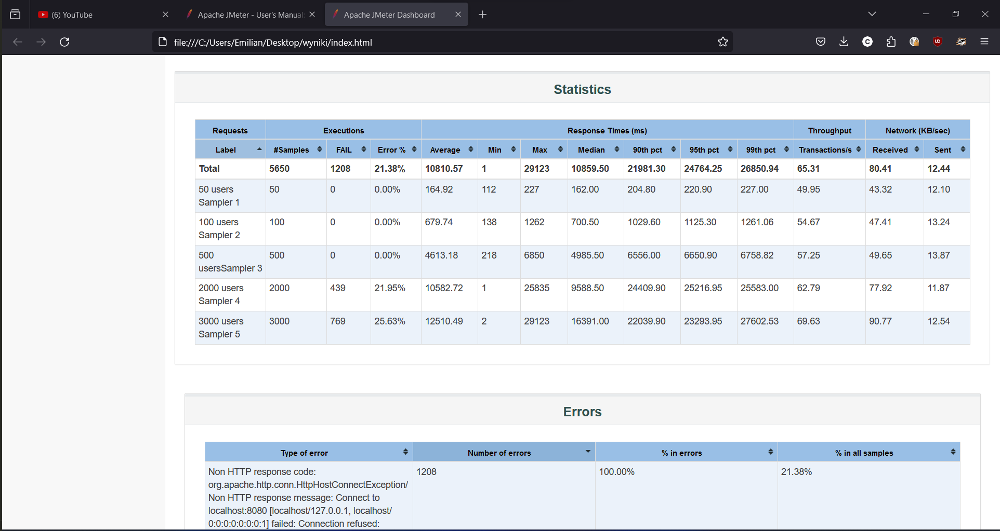

# Testy w Apache JMeter

## Testy wydajnościowe:
 Testy wydajnościowe polegają na sprawdzeniu jak aplikacja zachowuje się pod obciążeniem. W tym celu wykorzystujemy 
 narzędzie Apache JMeter. Jako aplikacje testową użyłem backendowej aplikacji napisanej w Spring Boot która kiedyś 
 napisałem. Aplikacja ta pozwala na zarządzanie fabryką samochodów. Umożliwia dodawanie, usuwanie, modyfikowanie i pobieranie samochodów, 
 silników i części samochodowych. Zawiera również autoryzacje i uwierzytelnianie użytkowników. Aplikacja ta jest w stanie
 dewleporskim, nie jest zoptymalizowana pod względem wydajnościowym, dlatego też wyniki testów mogą być nieco gorsze niż
 w przypadku aplikacji zoptymalizowanej, jednakże pozwoli to na zobrazowanie jak wygląda proces testowania wydajnościowego.
 W scenariszu skupie sie na testowanie endpointu służacego do logowania użytkownika. 

### Endpoint logowania

### Przygotowanie testu
Testy wydajnościowe polegają na symulowaniu wielu użytkowników, którzy wykonują określone akcje. W tym przypadku
użytkownicy będą logować się do aplikacji. W tym celu należy stworzyć test plan. W tym celu klikamy prawym przyciskiem myszy
na Test Plan i wybieramy opcje Add -> Threads (Users) -> Thread Group. Następnie w polu Number of Threads (users) wpisujemy
liczbę użytkowników, którzy będą wykonywać testy. Założyłem sobie sprawdzenie jak aplikacja bedzie zachowywac sie przy
50, 100 i 300 użytkownikach logujacych sie w tym samym momencie.

Następnie należy dodać do test planu endpoint, który będzie testowany. W tym celu klikamy prawym przyciskiem myszy na Thread Group
i wybieramy opcje Add -> Sampler -> HTTP Request. Następnie w polu Server Name or IP wpisujemy adres serwera, na którym
znajduje się aplikacja. W tym przypadku jest to localhost. W polu Path wpisujemy endpoint, który będzie testowany. 
W wypadku mojej aplikacji jest to /token ponieważ to jest endpoint do logowania, który zwraca bearer token.

Z racji że nasza aplikacja wymaga uwierzytelnienia, musimy dodać do naszego requestu nagłówek Authorization. W tym celu
klikamy prawym przyciskiem myszy na HTTP Request i wybieramy opcje Add -> Config Element -> HTTP Header Manager.
Dodajemy nagłówek Authorization i w polu Value wpisujemy Basic a następnie kodujemy nasze dane do logowania w Base64.
Używam jednych poświadczeń wieć moga być hardcoded. W przypadku gdybyśmy chcieli testować aplikacje z wieloma użytkownikami
należałoby wygenerować wiele par login:hasło i zapisac je w pliku csv, a następnie użyć komponentu CSV Data Set Config.

Po kilku próbach puszczenia testów zauważyłem że warto dodąć jeszcze więcej grup użytkowników, ostateczie zdecydowałem się
na 100, 200, 500, 2000, 3000 requestów na raz. Ostatecznie wygląda to tak:

### Odpalenie testów
Zalecane jest odpalanie testów w nonGUI mode ze względu na mniejsze zużycie zasobów.

### Wyniki
Po wpisaniu odpowiedzniej komendy w terminalu, JMeter wygeneruje plik .jtl, jak i również wygenruje raport w formacie html.

Jak widać na powyższym obrazku, jeśli chodzi o czas odpowiedzi aplikacja zachowuje sie świetnie do 50 użytkowników,
jednakże przy 100 użytkownikach czas odpowiedzi zaczyna rosnąć. Przy 50 użytkownikach APDEX wynosi tylko 0.061 wiec czasy odpowiedzi są 
nieakceptowalne. Ostatecznie tylko 78.62% requestów zostało obsłużonych poprawnie mimo dużego czasu odpowiedzi.

W powyżeszej tabeli można zauważyć ciekawe rzeczy. Przy 50, 200 i 500 użytkownikach 100% requestów zostało obsłużonych
poprawnie, jednakże przy 2000 i 3000 około 22% requestów zostało obsłużonych niepoprawnie. Można również zauważyć rozstrzał pomiędzy
przy średnim czasie odpowiedzi  dla 100 użytwników czas oscylował wokół 680 milisekund a dla 500 to już 4613 milisekund.

### Podsumowanie
Jmeter to dosyc wygodne narzędzie do testowanie wydajnościowego, sam interfejs jest doscyć przyjazny i intuicyjny, jednakże 
wymaga ono trochę czasu na zapoznanie się z nim. Szczególnie opcja customizowania roportów w porsty interaktywny sposób
byłaby bardzo przydatna. Zalecany sposób odpalania testów wydajnosciowych w nonGUI mode jest zrozumiały ale troche uciążlywy.
Warto również zwrócić uwagę na to, że testy wydajnościowe są bardzo kosztowne
i mój komputer nieźle sie nagrzał podczas testów. Napewno aplikacja na prawidzwym serwerze produkcyjnym zachowywała by się
lepiej, mimo wszystko ćwiczenie nauczyło mnie jak przeprowadza się testy wydajnościowe i jakie są ich zalety i wady.
